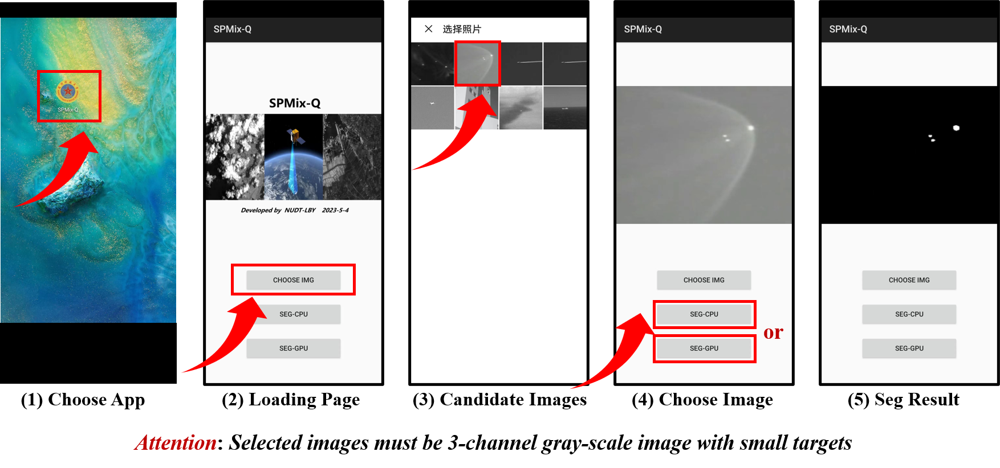

# Mixed-Precision Network Quantization for Single-frame Infrared Small Target Segmentation

This is the deployable APK file of the method in our paper "Mixed-Precision Network Quantization for Single-frame Infrared Small Target Segmentation". The reader can easily achieve single-frame infrared small target segmentation on android-based mobile device (e.g., (a) Huawei-M20 with Kyrin810, (b) Realme X7 with Dimensity 800U, (c) Xiaomi 8L with Snapdragon 660). This APK is trained with ResUnet on the NUAA-SIRST dataset. More edge-device deployable will comming soon. Please keep attention! 

#### 1. Download SPMix-Q(ResUnet).apk.
* [The APK download dir]([https://github.com/YimianDai/sirst](https://pan.baidu.com/s/1qh3UzyUZFDmkoV7CDl2U3Q?pwd=nudt)) (Extraction Code: nudt)
#### 2. Install the APK with USB line.
#### 3. Follwing the pipeline and enjoy it.
